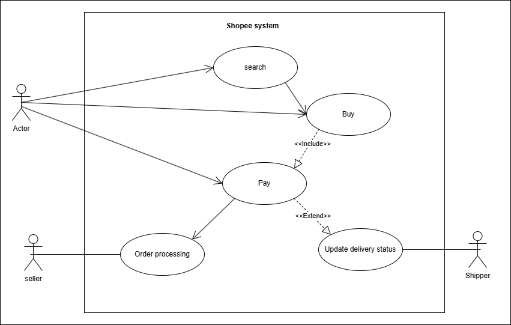

# Phân tích Use Case cho Ứng dụng Shopee

## 1. Phân tích Actor và Use Case

| Actor | Mô tả vai trò |
| :--- | :--- |
| **1. Người mua (Buyer)** | Actor chính, người có nhu cầu tìm kiếm, xem xét và mua sản phẩm được đăng bán trên Shopee. |
| **2. Người bán (Seller)** | Actor chính, người sử dụng nền tảng để đăng bán sản phẩm, quản lý gian hàng và xử lý các đơn hàng từ Người mua. |
| **3. Shipper (Nhân viên giao hàng)** | Actor chính, người chịu trách nhiệm nhận hàng từ Người bán và giao đến cho Người mua, đồng thời cập nhật trạng thái đơn hàng trên hệ thống. |

**5 Use Case tiêu biểu:**

1.  **Tìm kiếm sản phẩm:** Người mua sử dụng bộ lọc và từ khóa để tìm các mặt hàng mong muốn.
2.  **Mua hàng:** Người mua thực hiện các bước để đặt mua sản phẩm, bao gồm chọn sản phẩm, xác nhận địa chỉ và thanh toán.
3.  **Thanh toán:** Là một phần bắt buộc của Use Case "Mua hàng", nơi hệ thống xử lý giao dịch.
4.  **Xử lý đơn hàng:** Người bán xác nhận đơn hàng, đóng gói và chuẩn bị giao cho đơn vị vận chuyển.
5.  **Cập nhật trạng thái giao hàng:** Shipper dùng ứng dụng để cập nhật các trạng thái như "Đã lấy hàng", "Đang giao", "Giao hàng thành công".

---

## 2. Sơ đồ Use Case Diagram

---

## 3. Mô tả chi tiết Use Case: Mua hàng

**Tên Use Case:** Mua hàng (Purchase Product)

**Actor:**
* **Primary Actor:** Người mua (Buyer)
* **Supporting Actors:** Hệ thống (System), Người bán (Seller)

**Mục tiêu:**
Người mua chọn các sản phẩm đã thêm vào giỏ hàng, cung cấp thông tin giao hàng, áp dụng mã giảm giá (nếu có) và hoàn tất thanh toán để tạo một đơn hàng thành công.

### Luồng chính (Main Flow / Happy Path)

1.  Người mua truy cập giỏ hàng và chọn các sản phẩm muốn mua.
2.  Người mua bấm nút "Mua hàng".
3.  Hệ thống hiển thị trang "Thanh toán", bao gồm:
    * Địa chỉ nhận hàng (mặc định hoặc cho phép thay đổi).
    * Thông tin sản phẩm (số lượng, giá).
    * Đơn vị vận chuyển (cho phép lựa chọn).
    * Mã giảm giá/voucher (cho phép áp dụng).
    * Phương thức thanh toán.
    * Tổng số tiền cuối cùng.
4.  Người mua xác nhận địa chỉ, chọn đơn vị vận chuyển và phương thức thanh toán.
5.  Người mua bấm nút **"Đặt hàng"**.
6.  Hệ thống xác thực đơn hàng, tạo một đơn hàng mới với trạng thái "Chờ xác nhận".
7.  Hệ thống gửi thông báo đặt hàng thành công cho Người mua và gửi thông báo có đơn hàng mới cho Người bán.
8.  Use Case kết thúc thành công.

### Luồng lỗi (Error Flows / Alternative Paths)

**Luồng lỗi A: Sản phẩm trong giỏ hàng hết hàng hoặc thay đổi giá**

* *Xảy ra tại bước 2.*
1.  Hệ thống kiểm tra và phát hiện một sản phẩm đã hết hàng hoặc có giá khác so với lúc thêm vào giỏ.
2.  Hệ thống hiển thị thông báo lỗi, yêu cầu Người mua xóa sản phẩm đó khỏi giỏ hàng hoặc chấp nhận giá mới để tiếp tục.
3.  Người mua quay trở lại giỏ hàng (bước 1).

**Luồng lỗi B: Mã giảm giá không hợp lệ**

* *Xảy ra tại bước 4.*
1.  Người mua nhập một mã giảm giá đã hết hạn, không tồn tại hoặc không đủ điều kiện áp dụng.
2.  Hệ thống hiển thị thông báo "Mã giảm giá không hợp lệ".
3.  Người mua có thể nhập mã khác hoặc tiếp tục đặt hàng mà không có giảm giá.

**Luồng lỗi C: Thanh toán online thất bại**

* *Xảy ra tại bước 5 nếu Người mua chọn thanh toán online.*
1.  Giao dịch tại cổng thanh toán không thành công.
2.  Hệ thống hiển thị thông báo "Thanh toán thất bại".
3.  Hệ thống đề nghị Người mua thử lại hoặc chọn một phương thức thanh toán khác (quay lại bước 4).