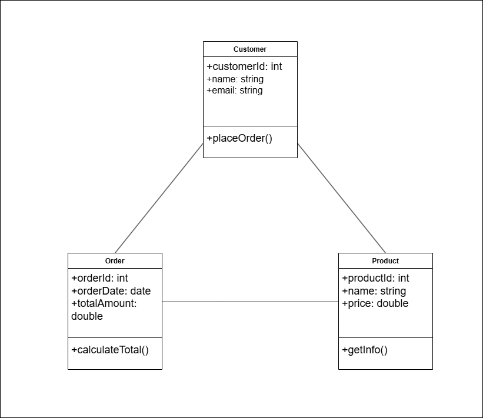

# Mô tả chức năng của từng lớp

## Lớp Product (Sản phẩm)

- **Chức năng**: Đại diện cho một mặt hàng cụ thể được bán. Lớp này chịu trách nhiệm lưu trữ tất cả thông tin liên quan đến sản phẩm như tên, giá cả, và mô tả.

- **Thuộc tính (Attributes):**

    - `productId`: Mã định danh duy nhất cho mỗi sản phẩm.

    - `name`: Tên của sản phẩm.

    - `price`: Giá bán của sản phẩm.

- **Phương thức (Methods)**:

    - `getInfo()`: Trả về thông tin chi tiết của sản phẩm.

## Lớp Customer (Khách hàng)

- **Chức năng**: Đại diện cho người mua hàng. Lớp này quản lý thông tin cá nhân của khách hàng và các hành động họ có thể thực hiện, chẳng hạn như tạo đơn hàng.

- **Thuộc tính (Attributes)**:

    - `customerId`: Mã định danh duy nhất cho mỗi khách hàng.

    - `name`: Tên của khách hàng.

    - `email`: Địa chỉ email để liên lạc.

- **Phương thức (Methods)**:

    - `placeOrder()`: Cho phép khách hàng tạo một đơn hàng mới.

## Lớp Order (Đơn hàng)

- **Chức năng**: Đại diện cho một giao dịch mua hàng được thực hiện bởi một khách hàng. Lớp này liên kết giữa khách hàng và các sản phẩm họ mua, đồng thời quản lý các thông tin như ngày đặt hàng và tổng giá trị.

- **Thuộc tính (Attributes)**:

    - `orderId`: Mã định danh duy nhất cho mỗi đơn hàng.

    - `orderDate`: Ngày mà đơn hàng được tạo.

    - `totalAmount`: Tổng giá trị của tất cả sản phẩm trong đơn hàng.

- **Phương thức (Methods)**:

    - `calculateTotal()`: Tính toán tổng giá trị đơn hàng dựa trên các sản phẩm đã được thêm vào.