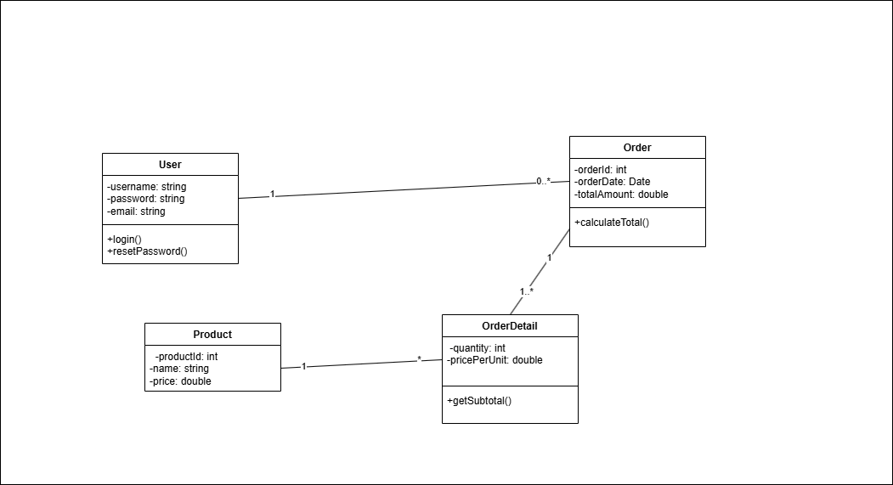

# Tìm lỗi sai và sửa

## Lỗi 1: Sai Multiplicity (Số lượng)
Mô tả: Sơ đồ đang thể hiện mối quan hệ 1-1 giữa User và Order. Điều này có nghĩa là "một người dùng chỉ có thể có một đơn hàng và một đơn hàng chỉ thuộc về một người dùng duy nhất".

Tại sao sai: Trong thực tế, một người dùng (User) phải có khả năng đặt nhiều đơn hàng (Order) theo thời gian. Mối quan hệ đúng phải là một-nhiều (1 - *).

Loại lỗi: Lỗi logic quan hệ.

## Lỗi 2: Vi Phạm Nguyên Tắc Đóng Gói (Encapsulation)
Mô tả: Tất cả các thuộc tính (username, password, email, OrderId...) đều được đặt là public (dấu +).

Tại sao sai: Điều này vi phạm nguyên tắc cơ bản của lập trình hướng đối tượng là đóng gói. Dữ liệu của một đối tượng nên được che giấu và chỉ có thể truy cập thông qua các phương thức công khai. Việc để thuộc tính public cho phép các đối tượng bên ngoài tự do thay đổi trạng thái nội tại, gây khó khăn cho việc kiểm soát và bảo trì. Các thuộc tính nên là private (dấu -).

Loại lỗi: Lỗi Modifier (Phạm vi truy cập).

## Lỗi 3: Thiết Kế Thiếu Logic và Không Đầy Đủ
Mô tả: Lớp Order có phương thức calculateTotal() nhưng lại không có thông tin về các sản phẩm trong đơn hàng đó. Làm thế nào để tính tổng tiền (totalAmount) nếu không biết đơn hàng gồm những gì, số lượng bao nhiêu, đơn giá thế nào?

Tại sao sai: Sơ đồ thiếu các lớp quan trọng như OrderDetail (Chi tiết đơn hàng) và Product (Sản phẩm) để mô hình trở nên hợp lý và có thể hoạt động được.

Loại lỗi: Lỗi thiết kế, thiếu sót logic.

## Sửa lại

