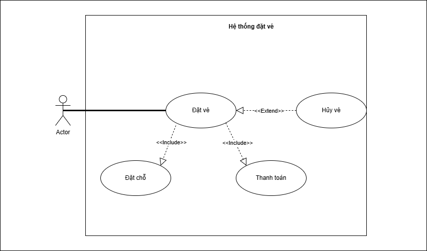

# Mô tả Use Case: Hệ thống Đặt vé Xem phim Online

---

### 1. Use Case: Đặt chỗ

| Mục | Giải thích |
| :--- | :--- |
| **Tên Use Case** | Đặt chỗ |
| **Mã Use Case (ID)** | UC01 |
| **Actor liên quan** | Người dùng |
| **Mô tả tóm tắt** | Cho phép Người dùng chọn phim, suất chiếu (ngày, giờ) và hoàn tất quá trình đặt vé, bao gồm các bước chọn ghế và thanh toán. |
| **Điều kiện tiên quyết** | Người dùng đã truy cập vào hệ thống (website hoặc ứng dụng). |
| **Luồng chính (Main Flow)** | 1. Người dùng chọn chức năng "Đặt vé" trên giao diện. 2. Hệ thống hiển thị danh sách phim và các suất chiếu có sẵn. 3. Người dùng chọn Phim. 4. Người dùng chọn Ngày xem và Giờ xem (suất chiếu). 5. Hệ thống ghi nhận suất chiếu và thực thi Use Case `UC02: Chọn ghế`. 6. Sau khi `UC02` hoàn tất, hệ thống thực thi Use Case `UC03: Thanh toán`. 7. Sau khi `UC03` hoàn tất thành công, hệ thống tạo vé, lưu thông tin giao dịch. 8. Hệ thống hiển thị thông báo đặt vé thành công và thông tin vé (mã vé, QR code) cho Người dùng. |
| **Luồng phụ (Alternative Flow)** | (Không có. Các luồng rẽ nhánh được xử lý trong các Use Case con là UC02 và UC03). |
| **Luồng lỗi (Exception Flow)** | **FE 1.1:** Nếu `UC02: Chọn ghế` thất bại (người dùng thoát):  1. Hệ thống hủy phiên đặt vé.  2. Quay lại bước 2 (hoặc màn hình chính). **FE 1.2:** Nếu `UC03: Thanh toán` thất bại:  1. Hệ thống thông báo thanh toán thất bại (chi tiết trong UC03).  2. Phiên đặt vé bị hủy, các ghế đã chọn được giải phóng. |
| **Kết quả thành công** | Vé được đặt thành công. Thông tin vé được lưu trữ và gửi đến Người dùng. Ghế ngồi được cập nhật trạng thái "Đã bán". |
| **Kết quả thất bại** | Vé không được đặt. Ghế ngồi (nếu đã chọn) được giải phóng. |
| **Ghi chú** | Đây là Use Case cơ sở (base use case). Nó "bao gồm" (includes) `UC02: Chọn ghế` và `UC03: Thanh toán`. |

---

### 2. Use Case: Chọn ghế

| Mục | Giải thích |
| :--- | :--- |
| **Tên Use Case** | Chọn ghế |
| **Mã Use Case (ID)** | UC02 |
| **Actor liên quan** | Người dùng |
| **Mô tả tóm tắt** | Cho phép Người dùng chọn (các) ghế ngồi cụ thể trong rạp cho suất chiếu đã chọn. |
| **Điều kiện tiên quyết** | Người dùng đã chọn thành công Phim và Suất chiếu (đang ở bước 5 của UC01). |
| **Luồng chính (Main Flow)** | 1. Hệ thống hiển thị sơ đồ rạp chiếu tương ứng với suất chiếu, bao gồm trạng thái các ghế (trống, đã đặt, đang chọn). 2. Người dùng nhấp chọn một hoặc nhiều ghế "trống". 3. Hệ thống cập nhật trạng thái ghế thành "đang chọn" và hiển thị tổng tiền tạm tính. 4. Người dùng nhấn nút "Xác nhận" (hoặc "Tiếp tục"). 5. Hệ thống tạm giữ các ghế này cho phiên giao dịch. |
| **Luồng phụ (Alternative Flow)** | **AF 2.1:** Người dùng đổi ghế:  1. Người dùng nhấp vào ghế "đang chọn" để bỏ chọn (ghế chuyển về "trống").  2. Người dùng chọn ghế "trống" khác.  3. Hệ thống cập nhật lại tổng tiền.  4. Quay lại bước 4 của Luồng chính. |
| **Luồng lỗi (Exception Flow)** | **FE 2.1:** Hết thời gian giữ ghế:  1. Người dùng không thao tác trong một khoảng thời gian quy định (ví dụ 5 phút).  2. Hệ thống tự động giải phóng các ghế "đang chọn".  3. Hệ thống hiển thị thông báo "Đã hết thời gian chọn ghế" và yêu cầu Người dùng thực hiện lại (hoặc hủy phiên). **FE 2.2:** Ghế đã bị người khác chọn (xung đột):  1. Tại bước 4, hệ thống kiểm tra lại.  2. Nếu ghế Người dùng vừa chọn đã bị một giao dịch khác hoàn tất, hệ thống báo lỗi: "Ghế [Tên ghế] vừa bị người khác đặt. Vui lòng chọn ghế khác."  3. Tải lại sơ đồ rạp (bước 1). |
| **Kết quả thành công** | (Các) ghế mong muốn được tạm giữ thành công cho Người dùng để chuyển sang bước thanh toán. |
| **Kết quả thất bại** | Không có ghế nào được chọn/giữ. Người dùng phải chọn lại hoặc phiên giao dịch bị hủy. |
| **Ghi chú** | Use case này được "bao gồm" (included) bởi `UC01: Đặt chỗ`. |

---

### 3. Use Case: Thanh toán

| Mục | Giải thích |
| :--- | :--- |
| **Tên Use Case** | Thanh toán |
| **Mã Use Case (ID)** | UC03 |
| **Actor liên quan** | Người dùng, Hệ thống thanh toán (Secondary Actor) |
| **Mô tả tóm tắt** | Người dùng thực hiện trả tiền cho (các) vé đã chọn thông qua một cổng thanh toán/ngân hàng. |
| **Điều kiện tiên quyết** | Người dùng đã hoàn tất `UC02: Chọn ghế`. Hệ thống đang tạm giữ ghế cho Người dùng. |
| **Luồng chính (Main Flow)** | 1. Hệ thống hiển thị tóm tắt đơn hàng (thông tin phim, suất chiếu, số ghế, tổng số tiền). 2. Hệ thống hiển thị các phương thức thanh toán (ví dụ: Ví điện tử, Thẻ ngân hàng...). 3. Người dùng chọn một phương thức thanh toán. 4. Người dùng nhập thông tin theo yêu cầu của phương thức (ví dụ: nhập thông tin thẻ, quét mã QR ví...). 5. Người dùng xác nhận thanh toán. 6. Hệ thống gửi yêu cầu giao dịch đến `Hệ thống thanh toán` (bên thứ ba). 7. `Hệ thống thanh toán` xử lý và trả kết quả (thành công/thất bại). 8. Hệ thống nhận kết quả và ghi nhận giao dịch thành công. |
| **Luồng phụ (Alternative Flow)** | **AF 3.1:** Người dùng đổi phương thức thanh toán:  1. Trước khi xác nhận (bước 5), Người dùng nhấn "Quay lại" hoặc "Chọn phương thức khác".  2. Hệ thống quay lại bước 2. |
| **Luồng lỗi (Exception Flow)** | **FE 3.1:** Giao dịch bị từ chối:  1. `Hệ thống thanh toán` trả về kết quả thất bại (ví dụ: sai thông tin, không đủ số dư, thẻ hết hạn...).  2. Hệ thống hiển thị thông báo lỗi cho Người dùng.  3. Hệ thống cho phép Người dùng thử lại (quay lại bước 3) hoặc Hủy giao dịch. **FE 3.2:** Hết thời gian thanh toán:  1. Người dùng không hoàn tất bước 5 trong thời gian quy định (ví dụ 10 phút).  2. Hệ thống tự động hủy giao dịch.  3. Use case kết thúc thất bại. |
| **Kết quả thành công** | Giao dịch được xác nhận thành công. |
| **Kết quả thất bại** | Giao dịch không thành công. Use case `UC01` sẽ xử lý việc giải phóng ghế. |
| **Ghi chú** | Use case này được "bao gồm" (included) bởi `UC01: Đặt chỗ`. |

---

### 4. Use Case: Hủy vé

| Mục | Giải thích |
| :--- | :--- |
| **Tên Use Case** | Hủy vé |
| **Mã Use Case (ID)** | UC04 |
| **Actor liên quan** | Người dùng |
| **Mô tả tóm tắt** | Cho phép Người dùng hủy vé đã đặt thành công trước đó (thường là trước một khoảng thời gian nhất định so với suất chiếu). |
| **Điều kiện tiên quyết** | Người dùng đã đăng nhập vào hệ thống VÀ Người dùng có ít nhất một vé đã đặt thành công (trạng thái "Đã thanh toán"). |
| **Luồng chính (Main Flow)** | 1. Người dùng truy cập mục "Lịch sử đặt vé" (hoặc "Vé của tôi"). 2. Hệ thống hiển thị danh sách các vé Người dùng đã đặt. 3. Người dùng chọn vé muốn hủy và nhấn nút "Hủy vé".<f>4. Hệ thống kiểm tra điều kiện hủy (ví dụ: phải hủy trước 2 giờ so với giờ chiếu). 5. Hệ thống hiển thị thông báo xác nhận: "Bạn có chắc muốn hủy vé [Tên phim]? Bạn sẽ được hoàn [X]% tiền." 6. Người dùng chọn "Xác nhận". 7. Hệ thống cập nhật trạng thái vé thành "Đã hủy". 8. Hệ thống kích hoạt quy trình hoàn tiền (nếu có). 9. Hệ thống gửi thông báo hủy vé thành công cho Người dùng. |
| **Luồng phụ (Alternative Flow)** | **AF 4.1:** Người dùng không đồng ý hủy:  1. Tại bước 6, Người dùng chọn "Không" hoặc "Thoát".  2. Use case kết thúc, vé không bị hủy. |
| **Luồng lỗi (Exception Flow)** | **FE 4.1:** Không đủ điều kiện hủy vé:  1. Tại bước 4, hệ thống kiểm tra và phát hiện đã vi phạm chính sách (ví dụ: quá sát giờ chiếu).  2. Hệ thống hiển thị thông báo lỗi: "Đã quá thời gian cho phép hủy vé này."  3. Use case kết thúc thất bại. |
| **Kết quả thành công** | Vé được cập nhật trạng thái "Đã hủy". Ghế của vé này được cập nhật về trạng thái "trống". Quy trình hoàn tiền được bắt đầu. |
| **Kết quả thất bại** | Vé không bị hủy và giữ nguyên trạng thái "Đã thanh toán". |
| **Ghi chú** | Đây là một Use Case độc lập. Chính sách hủy (thời gian, % hoàn tiền) là một quy tắc nghiệp vụ (business rule) quan trọng. |