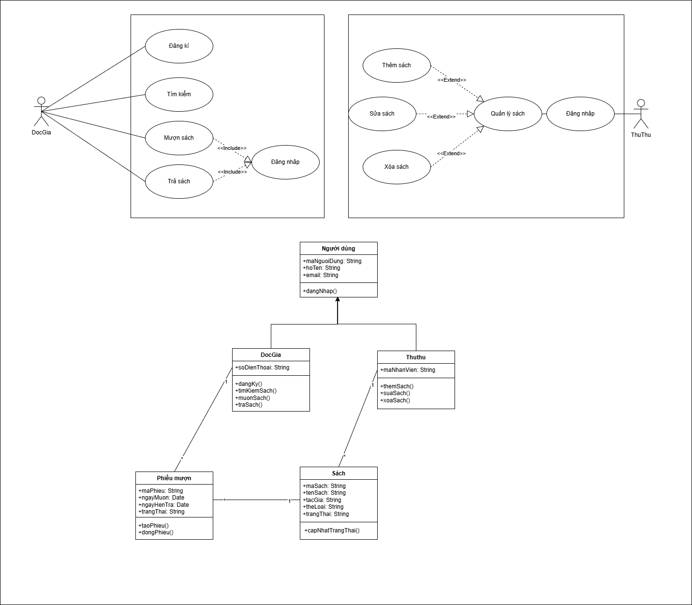

# Giải thích

## Giải thích Logic Chuyển đổi (Từ Use Case sang Class)

- Actors trở thành Classes (Tác nhân -> Lớp):

    - Mỗi Actor (tác nhân) trong Use Case Diagram thường trở thành một lớp trong Class Diagram, vì họ là người thực thi các hành vi.

    - Ví dụ: Actor Độc Giả -> Lớp DocGia. Actor Thủ Thư -> Lớp ThuThu.

    - Khi nhận thấy Độc Giả và Thủ Thư đều có chung các đặc điểm (như thông tin cá nhân, đăng nhập), chúng ta tạo ra một lớp cha NguoiDung (Người Dùng) và sử dụng Kế thừa (Generalization).

- Use Cases trở thành Methods (Trường hợp sử dụng -> Phương thức):

    - Các Use Case (hành động) mà một Actor thực hiện thường sẽ trở thành các phương thức (methods) của lớp Actor tương ứng.

    - Ví dụ: DocGia thực hiện (Tìm kiếm sách), (Mượn sách) -> Lớp DocGia có các phương thức timKiemSach(), muonSach().

    - Ví dụ: Thủ Thư thực hiện (Quản lý sách) (bao gồm thêm, sửa, xóa) -> Lớp ThuThu có các phương thức themSach(), suaSach(), xoaSach().

- Xác định các Lớp thực thể (Entity Classes) từ Nouns:

    - Các Use Case luôn tác động lên một thứ gì đó (danh từ - noun). Các danh từ này chính là các Lớp Thực thể (Entity Class) - nơi lưu trữ dữ liệu.

    - Ví dụ: (Tìm kiếm sách), (Mượn sách), (Trả sách), (Quản lý sách)... tất cả đều xoay quanh đối tượng "Sách". -> Chúng ta cần có lớp Sach để lưu trữ thông tin.

- Các Use Case nghiệp vụ tạo ra Lớp Liên kết (Association Class):

    - Một số Use Case không chỉ là một hành động đơn giản, mà còn tạo ra một "bản ghi" (record) về nghiệp vụ đó.

    - Ví dụ: Use case (Mượn sách) và (Trả sách) mô tả mối quan hệ Nhiều-Nhiều (Many-to-Many) giữa DocGia và Sach (Một độc giả mượn nhiều sách, một sách được nhiều độc giả mượn theo thời gian).

    - Để lưu trữ thông tin của mối quan hệ này (như ngayMuon, ngayTra), chúng ta tạo ra một Lớp Liên kết là PhieuMuon. Lớp này chứa logic để taoPhieu() (khi mượn) và dongPhieu() (khi trả).