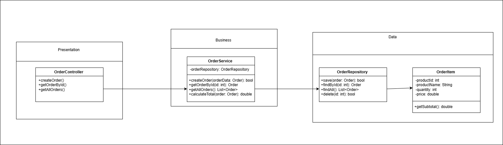

# Hệ thống bán hàng

## Các method

## Presentation Layer

- OrderController

createOrder(): Nhận dữ liệu từ client, gọi OrderService để tạo đơn hàng mới.

getOrderById(): Trả thông tin đơn hàng theo ID.

getAllOrders(): Lấy danh sách tất cả đơn hàng để hiển thị.

### Business Layer

- OrderService

createOrder(orderData: Order) → bool: Kiểm tra dữ liệu hợp lệ, tính tổng tiền, rồi gọi OrderRepository.save().

getOrderById(id: int) → Order: Lấy đơn hàng cụ thể từ repository.

getAllOrders() → List<Order>: Lấy tất cả đơn hàng hiện có.

calculateTotal(order: Order) → double: Tính tổng tiền từ các OrderItem.

## Data Layer

- OrderRepository

save(order: Order) → bool: Lưu đơn hàng xuống cơ sở dữ liệu.

findById(id: int) → Order: Tìm đơn hàng theo ID.

findAll() → List<Order>: Trả về danh sách toàn bộ đơn hàng.

delete(id: int) → bool: Xóa đơn hàng theo ID.

- OrderItem

Thuộc tính: productId, productName, quantity, price

getSubtotal() → double: Tính giá tiền của từng sản phẩm (quantity × price).