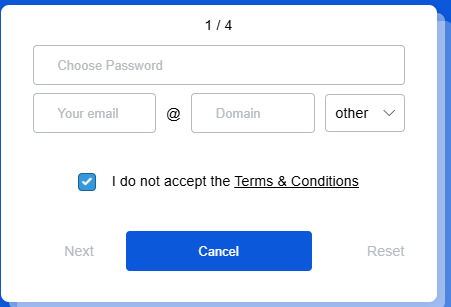

# Bai 1

### Bài phân tích UI/UX: Form đăng ký "lỗi"
**Đối tượng:** Giao diện form đăng ký (từ ảnh bạn cung cấp).

| Mục | Nội dung yêu cầu |
| :--- | :--- |
|
| **Nhận xét tổng quan** | Cảm giác đầu tiên là **cực kỳ bối rối và khó chịu**. Tôi không biết nên bắt đầu từ đâu. Form này dường như cố tình thách thức người dùng. Nó vi phạm mọi quy ước (convention) mà người dùng đã quen thuộc. |
| **Phân tích lỗi UI/UX** | **Lỗi UI (Giao diện):**   * **Phân cấp nút bấm (Button Hierarchy):** Nút chính "Next" bị làm chìm, trong khi nút phụ "Cancel" lại là nút nổi bật nhất. Điều này điều hướng người dùng làm hành động sai (rời khỏi trang).   * **Thiết kế Input:** Ô nhập email bị chia nhỏ một cách lố bịch. Nó không chỉ xấu mà còn không hiệu quả.   * **Tính nhất quán (Consistency):** Các nút "Next" và "Reset" không trông giống nút bấm, chúng chỉ là text. Nút "Cancel" thì lại là nút nền xanh. Thiếu sự đồng nhất.    **Lỗi UX (Trải nghiệm):**   * **Luồng logic (Logical Flow):** Bắt nhập "Password" trước "Email" là đi ngược lại luồng tư duy thông thường.   * **Ma sát (Friction):** Việc chia nhỏ email tạo ra "ma sát" (friction) cực lớn, bắt người dùng phải suy nghĩ và thực hiện nhiều thao tác hơn cho một việc đơn giản.   * **Dark Pattern (Trick Question):** Checkbox "I do not accept..." được tick sẵn là một cái bẫy. Nó lừa người dùng, khiến họ hoặc là (1) không thể tiếp tục, hoặc là (2) vô tình bỏ tick và *đồng ý* với điều khoản mà không nhận ra.   * **An toàn (Safety):** Đặt nút "Reset" ở ngay đó, dưới dạng text, là rất nguy hiểm. Người dùng có thể vô tình bấm vào và mất hết thông tin đã nhập. |
| **Nguyên nhân tiềm ẩn** | Đây gần như chắc chắn là một **thiết kế cố tình làm sai (Intentionally Bad Design)**.    * **Mục đích:** Thường được dùng trong các thử thách thiết kế (design challenges) hoặc làm ví dụ châm biếm để chỉ ra các lỗi *không bao giờ* nên mắc phải trong thiết kế form.   * **Nếu đây là sản phẩm thật:** Nguyên nhân là do người thiết kế hoàn toàn không hiểu gì về các nguyên tắc cơ bản của UI/UX, không tuân theo các quy chuẩn chung (design conventions), và không đặt người dùng làm trung tâm. |
| **Đề xuất cải tiến** | Cần phải **thiết kế lại hoàn toàn** form này theo đúng tiêu chuẩn:    1. **Thứ tự:** Đưa ô "Email" lên đầu, "Password" xuống dưới.   2. **Ô Email:** Chỉ dùng **một ô nhập (text field)** duy nhất cho Email.   3. **Checkbox:** Đổi văn bản thành "I accept the Terms & Conditions" và **không tick sẵn** (yêu cầu người dùng chủ động tick).   4. **Các nút bấm:**      * Nút `[Next]` (hoặc "Sign Up") phải là nút chính, màu xanh nổi bật.      * Nút `[Cancel]` nên là link text hoặc nút viền (outlined) và đặt ở bên trái.      * **Loại bỏ** nút `[Reset]`. Nó hầu như không bao giờ cần thiết và rất nguy hiểm. |
| **UI sau cải tiến (tùy chọn)** |     * **Mô tả:**   1. Ô "Your Email" (một ô duy nhất).   2. Ô "Choose Password".   3. Checkbox (chưa tick): "I accept the Terms & Conditions".   4. Nút `[Next]` (màu xanh, nền đặc) ở bên phải.   5. Nút `[Cancel]` (dạng text hoặc viền) ở bên trái. |

# Bai 2 -> Bai 7

https://www.figma.com/design/fAwYoycURxaZiDMh47VWI0/Untitled?node-id=0-1&p=f&t=7MZwi8snYcw5TUSO-0